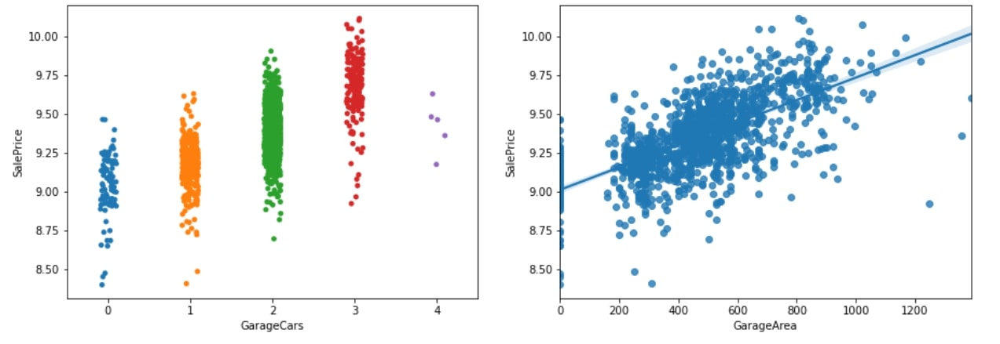

# Predicting House Prices Using Regression

## Table of contents
* [Introduction: Problem](#introduction)
* [Data](#data)
* [Exploratory Data Analysis](#analysis)
* [Regression modeling](#modeling)
* [Results and Conclusion](#results)

# Introduction: Problem
<b> House Prices: Advanced Regression Techniques</b>
 
The dataset for this project was acquired from Kaggle and it describes sales of individual residential properties in Ames, Iowa.
A Continuous target variable entails that regression models should be used for prediction.
The dataset contains a gamut of attributes that have an impact on the price. Certain features will be converted from an amorphous state to a more optimized form suited for regression. We'll deploy standard data science procedures to select features as well as create new ones to subsume all factors pertinent to predicting our target variable-The Sale Price. 

 

--

# Data

We have 81 columns in this dataset; one for the target variable, one for ID, and 79 for attributes. Not exactly a glut of attributes but enough to generate meaningful inferences. 

We'll analyze the target variable by generating a histogram.

Making the target variable normally distributed often leads to better results

Sale Price is not normally distributed, we will apply a transformation to it and then fit our regression to predict the transformed values

It's not necessary for the Linear Regression algorithm to have a y variable that is normally distributed; however, it is necessary for the errors to be normally distributed, and one way to ensure this is by transforming the y variable

We'll use <b>histograms</b> and the <b>D'Agostino K^2 Test</b> to determine normality

We'll apply the following three transformations :
<ol>
<li>Square root
<li>Log
<li>Box cox
</ol>    

Interpreting the D'Agostino K^2 score: 
The larger the p-value, the closer the distribution is to normal.

We will take a <b>small sample</b> of each distribution as the test detects even minor deviations in very large samples.

According to frequentist statistics, we can declare the distribution to be normal (more specifically: fail to reject the null hypothesis that it is normal) if p > 0.05.

According to our scores, the p values of Log and Box-Cox Transformations are <b>above 0.05</b> and since the p-value changes every time we sample; <b>We'll sample multiple times and consider the transformation that consistently results in a lower p-value.</b>The choice of transformation between Log and Boxcox is a trivial one as both have a similar effect on precision. We'll apply the BoxCox transformation to our target variable

#### Handling Missing Data

##### We'll extract columns that have missing values: 
 

The training dataset has 19 columns containing missing data and the test dataset has 33 columns containing missing data.
We'll be austere with the amount of missing data that is permissible by removing columns with more than 75% of missing data.  

 

## We'll impute the remaining missing values using a predefined function
We'll define a function to handle missing values and pass the names of columns containing missing values as the argument.

#### Transforming predictor variables for optimal model performance
We'll extract continuous predictor variables that are skewed and apply a log transform to make them more normally distributed.
 

 
Next, we'll one hot encode categorical variables
# Analysis
#### Exploratory Data Analysis
#### Let's explore our dataset for patterns and relationships between the target and predictor
The number of attributes seems involved; however, we'll only consider those attributes that have a siginificant correlation and remove any superfluous attributes using a heatmap

 

Let's select features which have a correlation magnitude <b>greater</b> than 0.6
 

#### 'OverallQual' has the highest correlation with our target followed by Year variables, this makes sense as recently built houses generally have higher prices

 
OverallQual seems to have a non-linear relationship, we can square this column to achieve linearity
 

There's clearly a premium on houses that were built more recently and have a higher overall quality. 
We'll create a new attribute to subsume this observation.
We can also divide the overall quality by the lot area to get a term that represents the overall quality per sqft.  

 

Let's take a closer look at the correlation of Total Basement Square ft. and Ground floor Living Area

 
We'll combine these two features to create a new feature since they are highly correlated

We can also combine Total Basement Square Ft, 1st and 2nd floor Square Ft to create a new variable which summarizes all three.  

 
Let's take a look at the relationship between the number of cars and garage area on price
 

Interestingly,  the Sale Price drops once we have more than 3 Garage Cars

#### Once we have created our new features, we'll remove all superfluous features and proceed towards modeling
--

# Modeling 
We'll split our training dataset into two; a training set and a validation set.
<b> Regularization a.k.a desensitization is very useful in analysing datasets which have a lot of variables</b>

##### We will model our raw data using Linear, Ridge, and Lasso Regression and we'll compare the efficacy of each model using their R2 scores.
 

####  Ridge regression performs slightly better as it doesn't cancel elements out by labelling their coefficients to 0(like Lasso)
#### Let's plot the actual values with our predicted values

We can observe a strong linear relationship which is an indicator of good model accuracy

# Results 
We'll apply the inverse BoxCox transform to our target variable to make it easier to construe.
 

The results of this project achieved a Root Mean Logarithmic Score 0.13286 ranking it in the top 20% of submissions.

--
